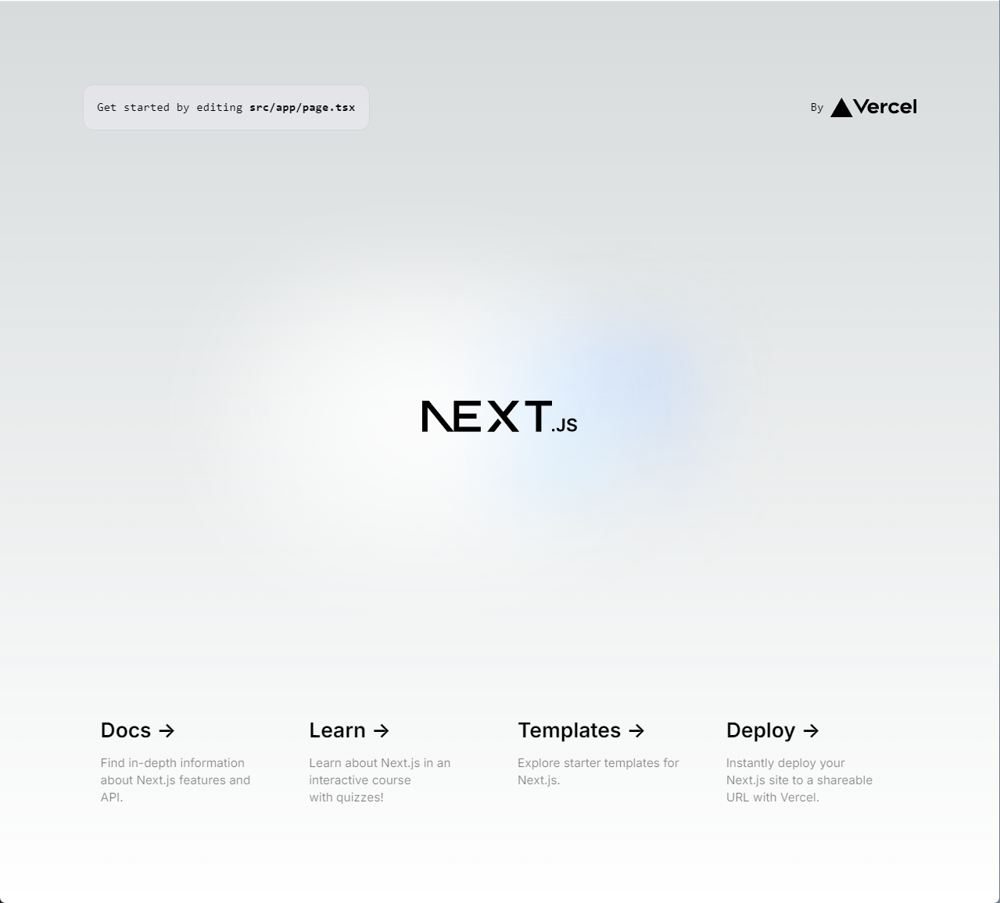

# 開発環境の構築
まずは、WSL 上に Docker で開発環境を構築します。
以下の構成で考えていますが、ひとまず Golang と Next.js の環境を構築します。

- バックエンド：[Golang](https://go.dev/)
- フロントエンド：[Next.js](https://nextjs.org/)
- データベース：[MySQL](https://www.mysql.com/jp/)
- ストレージ：[Minio](https://min.io/)

## Golang の開発環境
バックエンドは特にフレームワークを使わず、素の Golang で REST API サーバを構築します。
Golang は現時点で最新のバージョン 1.22 を利用します。

### Dockerfile の準備
```docker/backend``` ディレクトリに ```Dockerfile.dev``` を作成します。

```dockerfile
FROM golang:1.22-alpine

WORKDIR /app
```

### Docker Compose の準備
最上位階層のディレクトリに、```docker-compose.yml``` を作成します。

```yml
services:
  blog_backend:
    build:
      context: .
      dockerfile: ./docker/backend/Dockerfile
    container_name: backend_golang_container
    environment:
      - TZ=Asia/Tokyo
    ports:
      - 8000:8000
    tty: true
    volumes:
      - ./backend:/app
```

### ビルドとプロジェクトの初期化
以下のコマンドでコンテナイメージをビルドします。

```bash
$ docker compose build
```

次に、```go mod init``` コマンドでプロジェクトを初期化します。

```bash
$ docker compose run blog_backend go mod init example.com/go_project
```

すると、コンテナ内の ```/app``` (ローカル環境の ```backend```) ディレクトリの直下に ```go.mod``` ファイルが生成されます。
Go の開発環境の構築は、一旦完了です。

## TypeScript + React (Next.js) の開発環境
### Dockerfile の準備
まずは、ベースとなる Docker イメージを引っ張ってくるために ```docker/frontend``` に ```Dockerfile.dev``` を作成します。

```dockerfile
FROM node:20.16-slim

WORKDIR /app
```

### Docker Compose の準備
先ほど作成した ```docker-compose.yml``` に以下を追記します。

```yml
services:
  ...
  blog_frontend:
    build:
      context: .
      dockerfile: ./docker/frontend/Dockerfile.dev
    container_name: frontend_next_container
    environment:
      - TZ=Asia/Tokyo
      - WATCHPACK_POLLING=true
    ports:
      - 3000:3000
    tty: true
    volumes:
      - ./frontend:/app
```

### ビルドとプロジェクトの初期化
以下のコマンドでコンテナイメージをビルドします。

```bash
$ docker compose build
```

次に、コンテナを立ち上げて Next.js のプロジェクトを作成します。

```bash
$ docker compose run blog_frontend sh

# コンテナ内で作業
$ cd ../
$ yarn create next-app app --ts
yarn create v1.22.22
[1/4] Resolving packages...
[2/4] Fetching packages...
[3/4] Linking dependencies...
[4/4] Building fresh packages...
success Installed "create-next-app@14.2.5" with binaries:
      - create-next-app
✔ Would you like to use ESLint? … No / Yes
✔ Would you like to use Tailwind CSS? … No / Yes
✔ Would you like to use `src/` directory? … No / Yes
✔ Would you like to use App Router? (recommended) … No / Yes
✔ Would you like to customize the default import alias (@/*)? … No / Yes
Creating a new Next.js app in /app.
```

```docker-compose.yml``` に以下の行を追加してコンテナを起動します。

```yaml
services:
  ...
  blog_frontend:
    ...
    command: sh -c "yarn install && yarn dev"
```

```bash
$ docker compose up blog_frontend
```

[http://localhost:3000](http://localhost:3000) に接続して、Nest.js のトップページが表示されれば、完了です。

<div align="center">
    
</div>